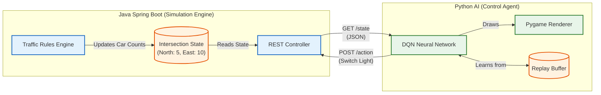

# Intelligent Traffic Control System (RL + Microservices)

A hybrid AI-driven traffic control system that uses **Reinforcement Learning (Q-Learning)** to optimize traffic flow in real-time. The system is built on a decoupled microservices architecture.

## Architecture
* **Simulation Engine (Java Spring Boot):** * Manages the intersection state, traffic rules, and threading. 
    * Exposes a RESTful API (`GET /state`, `POST /action`) for external control.
* **AI Agent (Python + Pygame):**
    * Acts as the "Brain" of the system.
    * Uses **Tabular Q-Learning** to learn optimal signal timing strategies.
    * Provides a "Digital Twin" visualization of the traffic flow.
      


## Key Features
* **Polyglot Microservices:** Seamless communication between Java (Backend) and Python (AI) via HTTP REST.
* **Reinforcement Learning:** The agent learns to minimize total wait time by penalized rewards (negative queue length).
* **Real-time Visualization:** Pygame rendering acts as a visual monitor for the backend state.

## Tech Stack
* **Backend:** Java 17, Spring Boot 3.x
* **AI/ML:** Python 3.10, NumPy, Q-Learning
* **Visualization:** Pygame
* **Communication:** REST API (JSON)

## How to Run
1.  **Start the Java Simulation:**
    ```bash
    cd backend-simulation
    ./mvnw spring-boot:run
    ```
2.  **Start the AI Agent:**
    ```bash
    cd ai-control-agent
    pip install -r requirements.txt
    python traffic_viz.py
    ```
